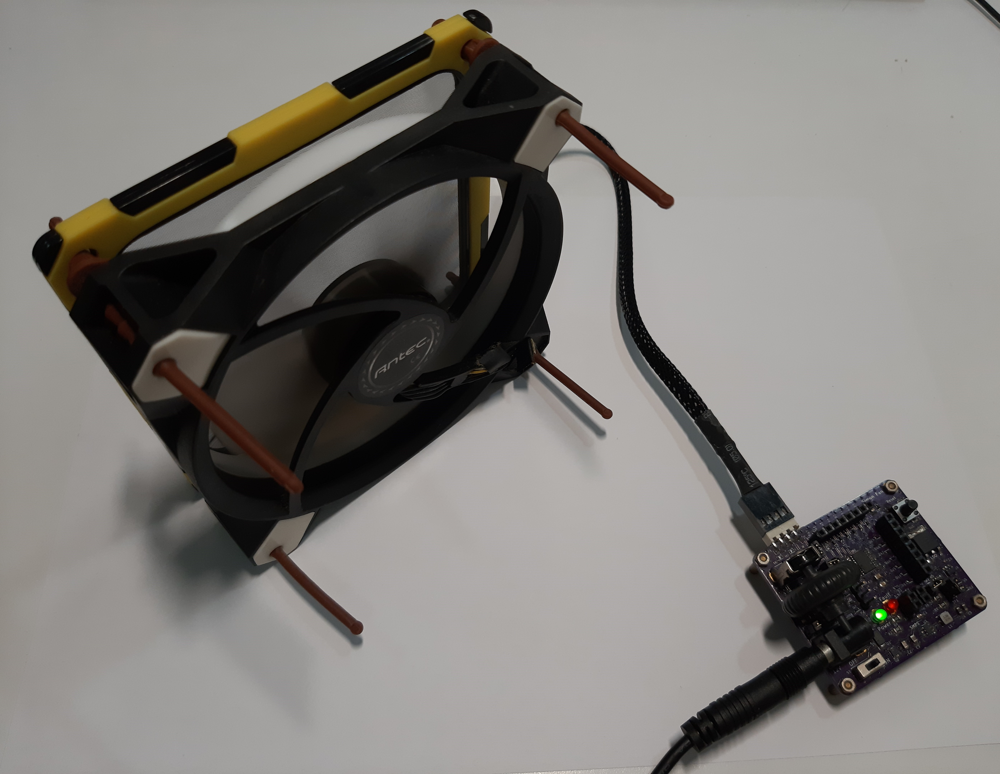
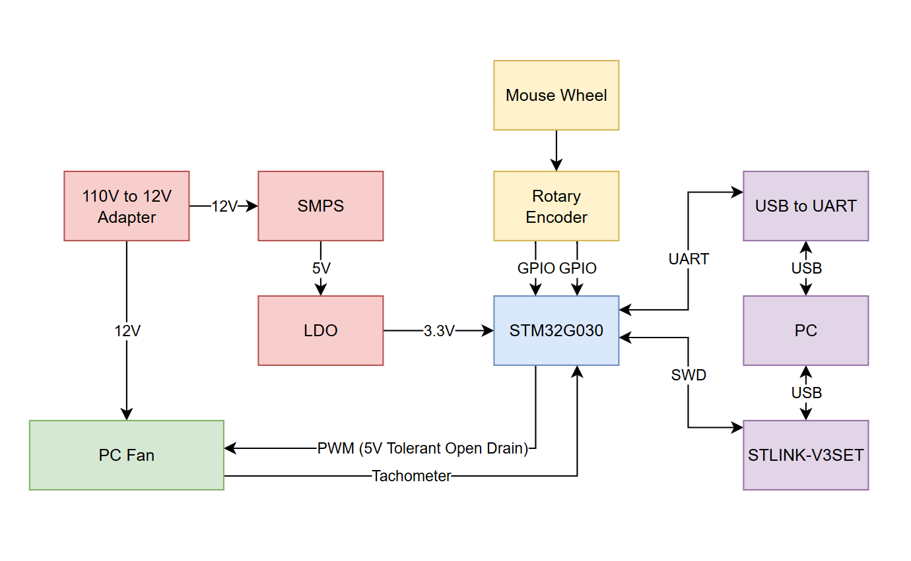
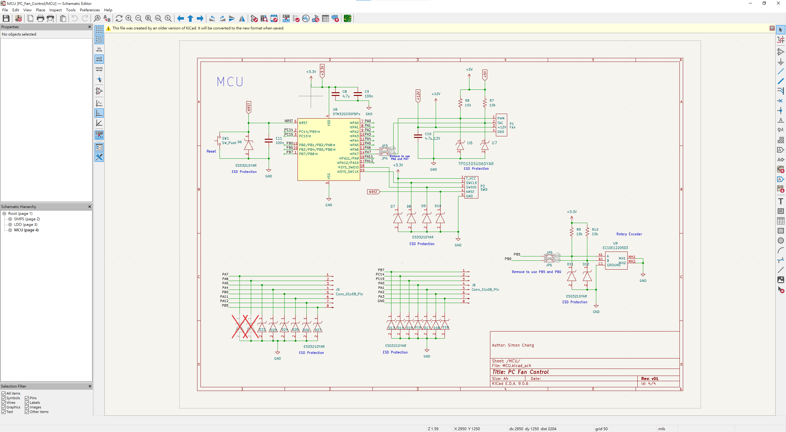
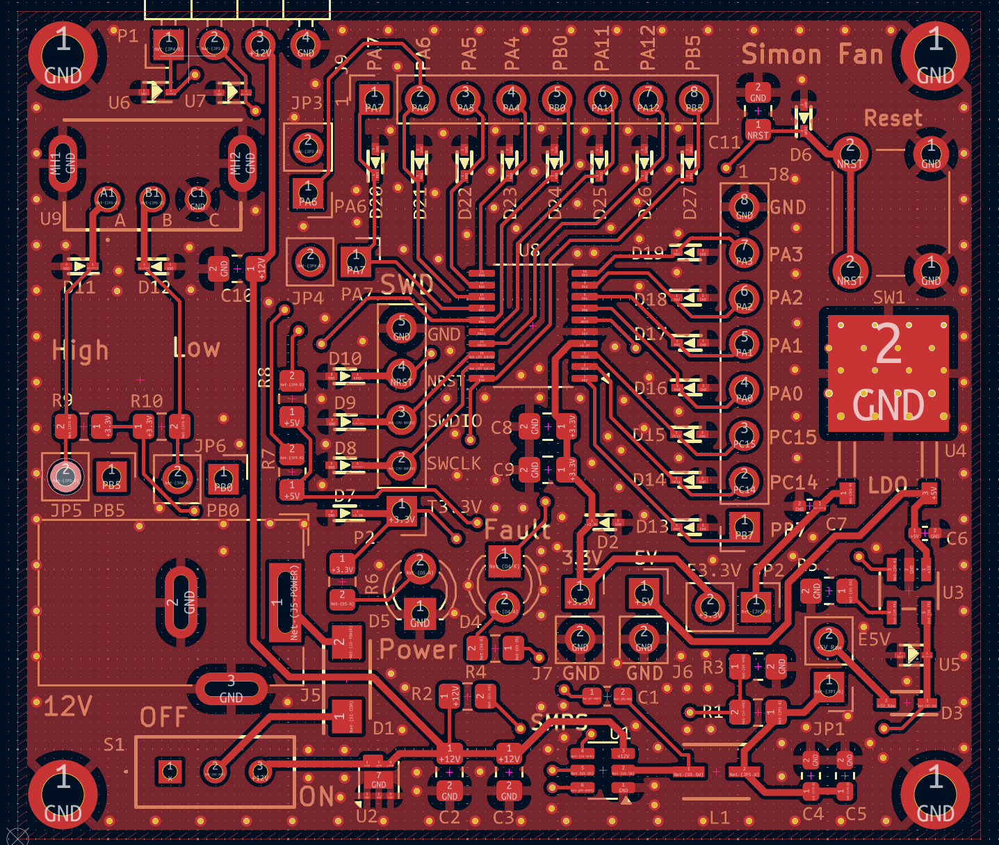
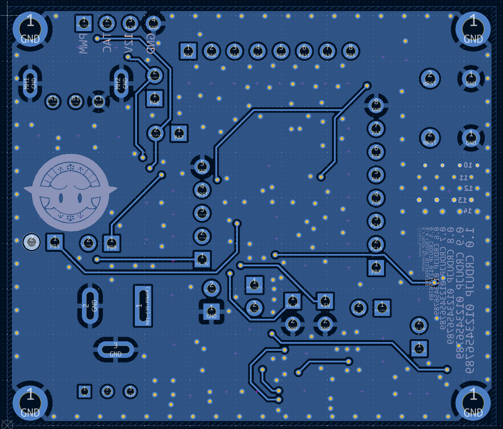
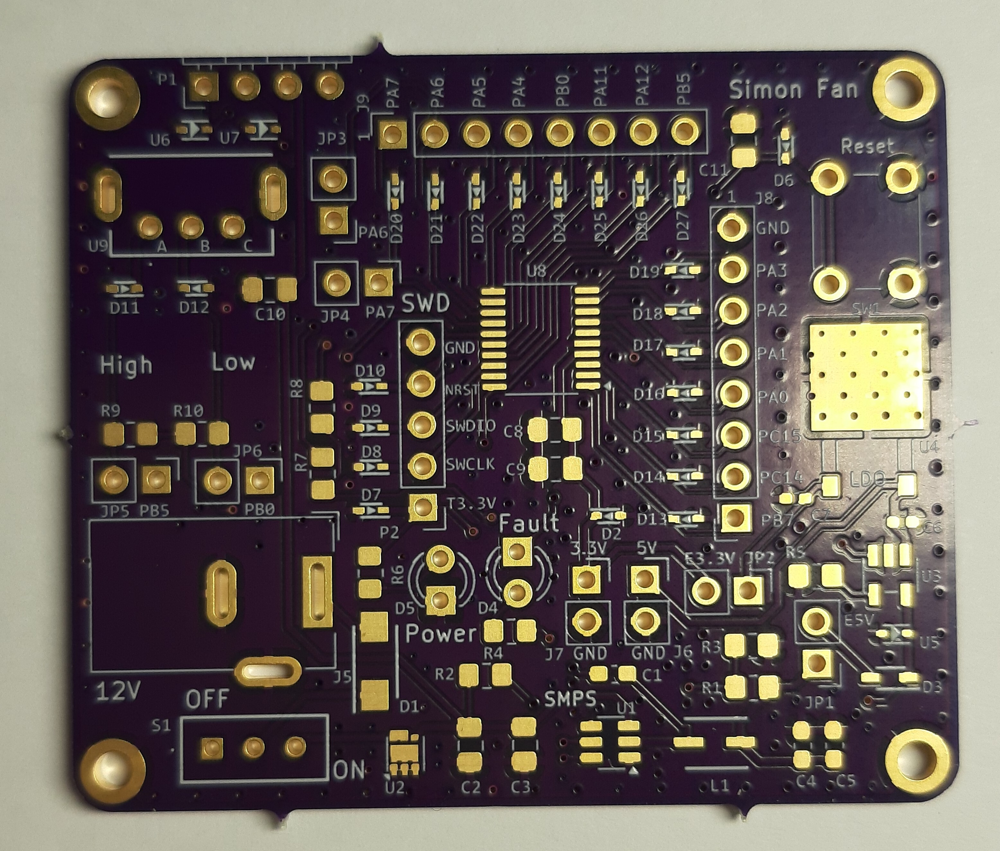
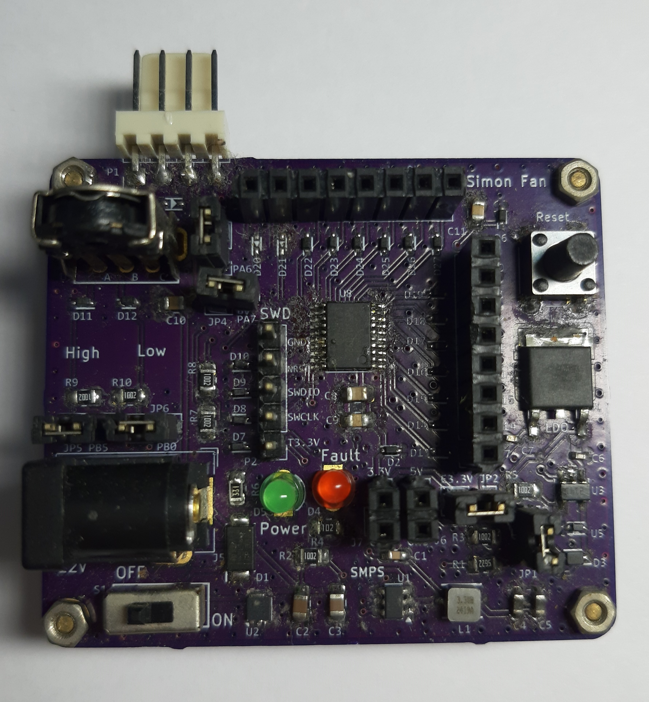

## Introduction
I have a PC fan that I removed from a CPU liquid cooler, and I'm powering it with a 12V power supply to use it for air filtration.  
However, when it's late at night, the fan's noise is a bit loud. But isn't this a PWM fan? I could use a development board to output a PWM signal and control the speed, but then I'd be short a development board.  
While searching online, I happened to come across a few useful online resources. I realized that in this day and age, this is actually possible to DIY a PCB board for simple device controls.  
* [Noctua PWM specifications white paper](https://cdn.noctua.at/media/Noctua_PWM_specifications_white_paper.pdf)
* [KiCad tutorial video from DigiKey](https://www.youtube.com/watch?v=vaCVh2SAZY4&list=PLEBQazB0HUyR24ckSZ5u05TZHV9khgA1O&index=1)
* [TI Power Dedigner](https://webench.ti.com/power-designer/)
* [OSH Park](https://oshpark.com/)
* [Mouser](https://www.mouser.com)

## Functionality

## Schematic - KiCad, Ti Power Deisgner  
* [KiCad](https://www.kicad.org/)  

## PCB Layout - KiCad  
* Front side

* Back side

### PCB Fabrication - OSH Park  

### Order Components - Mouser  

### Solder  

### Firmware  
* Programmer: STLINK-V3SET
* IDE: STM32CubeIDE
* Pin Define
    * PA7: PWM, TIM14_CH1
    * PA6: tachometer, TIM16_CH1
    * PB0: Rotary Encoder A (DI)
    * PB5: Rotary Encoder B (DI)
    * PA2: USART_TX
    * PA3: USART_RX
* Rotary Encoder Debouncing
    * Use TIM3 to periodically record last 10 pin states
        * if current state is 0, and there are at least eight 1s in the history, then change state to 1
        * if current state is 1, and there are at least eight 0s in the history, then change state to 0
* Debug USART: 115200, N, 8, 1